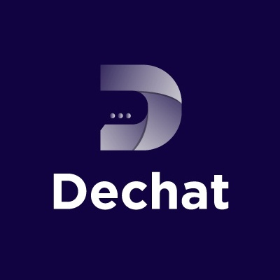

# DeChat - Decentralized Chat
A chat-room application integrating MetaMask authentication for Web3 users, using Moralis API. (Decentralized chat features coming soon...!!!). Currently, using a Rust-Rocket based EventSource API for chats, which is accessible here:

https://github.com/Vidali-Espisato/rust-chat-room

However, if you are a Web2 user, you can still be a part of it, using GoogleAuth.

&nbsp; &nbsp; &nbsp;

## Tech stack

- Node:         ^19.7.0
- Typescript:   5.1.3
- Next:         13.4.7
- React:        18.2.0
- Redux:        4.2.1
- Moralis:      ^2.22.3
- Next-auth:    ^4.22.1 (for GoogleAuth)
- TailwindCSS:  3.3.2
